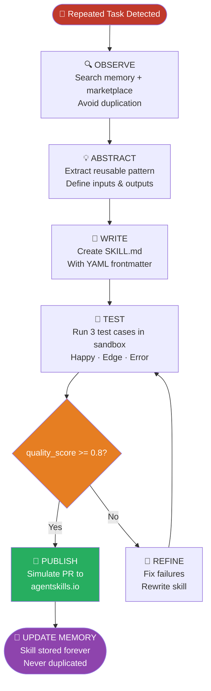
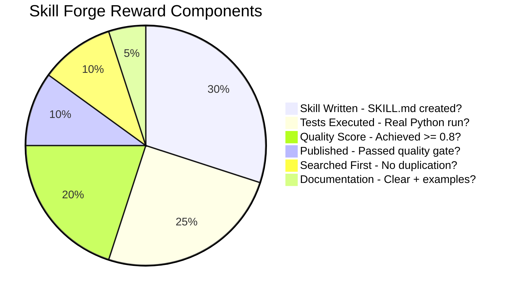
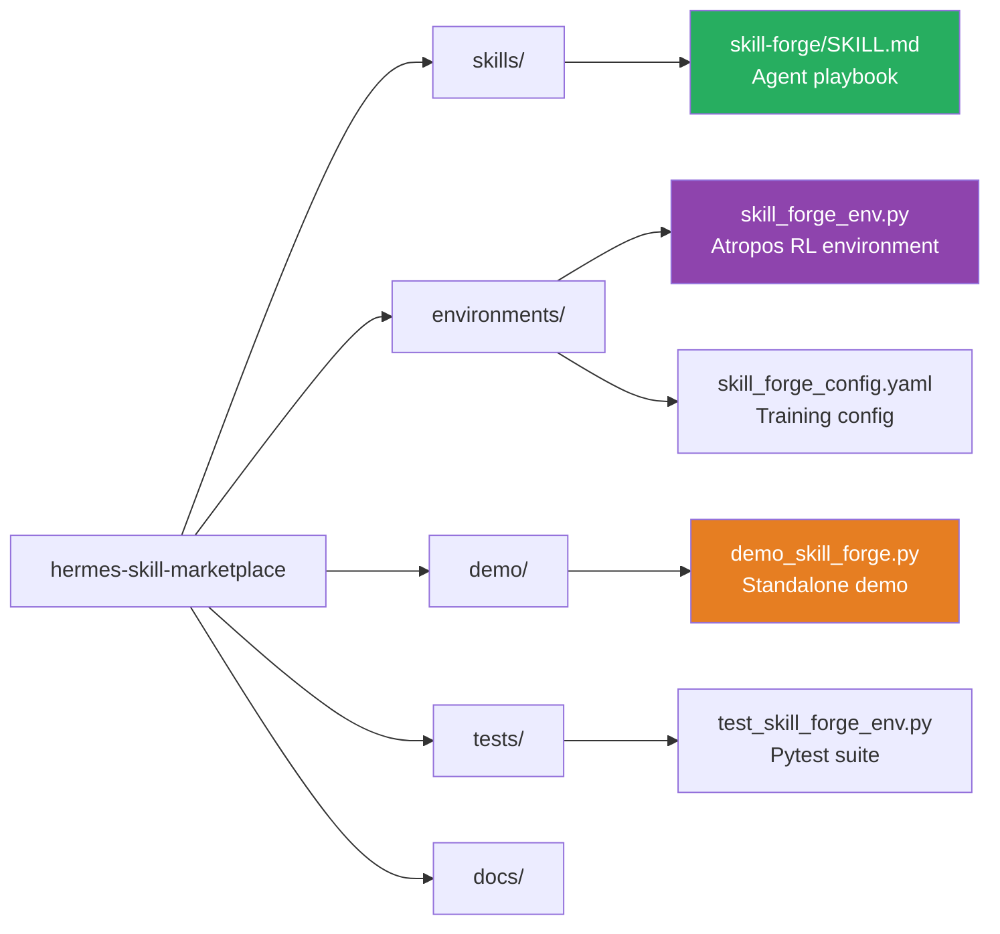

# Hermes Skill Forge 🔨

**Self-evolving agent that turns repeated tasks into reusable Skills - autonomously.**

> Built for the NousResearch "Show us what Hermes Agent can do" hackathon.

## What It Does

Hermes Skill Forge watches itself complete tasks, identifies reusable patterns,
writes a Skill, tests it in a Python sandbox, refines it until quality >= 0.8,
then publishes it to the agentskills.io marketplace.

**The more it works, the smarter it gets.**

## Architecture



## Hermes Features Used

| Feature | How It's Used |
|---------|--------------|
| **Memory** | Remembers every skill ever created - searches before writing to avoid duplication |
| **Skills** | Writes and self-installs new SKILL.md files to `~/.hermes/skills/` |
| **execute_code** | Tests each skill with 3 real Python test cases in a sandbox |
| **Auto-Evaluator** | After tests run, automatically calculates quality_score and triggers publish if >= 0.8 |
| **Subagents** | Parallel refinement loops when quality < 0.8 - rewrite and retest |
| **Atropos RL** | Reward function trains Hermes to forge better skills over time |
| **Gateway** | Simulates PR submission to agentskills.io community marketplace |

## Reward Function



## Quick Start

```bash
pip install openai rich
set OPENROUTER_API_KEY=sk-or-...

python demo/demo_skill_forge.py --task web-summarizer
python demo/demo_skill_forge.py --task log-analyzer
python demo/demo_skill_forge.py --task code-reviewer
```

## Demo Output (web-summarizer)

```
🧠 search_memory     → Memory is empty.
🔍 search_skills     → No matching skills found.
📝 write_file        → Written SKILL.md to ~/.hermes/skills/web-summarizer/
🧪 execute_code      → HAPPY ['sentence one', 'sentence two', 'sentence three']
🧪 execute_code      → EDGE  ['No content to summarize']
🧪 execute_code      → ERROR ValueError (handled gracefully)
[AUTO EVALUATOR]     → quality_score=1.00 ✓ - calling publish_skill
🚀 publish_skill     → Published! PR: github.com/NousResearch/agentskills/pull/1890

Quality score: 1.00 | Skills written: 1 | Published: 1
```

## Demo Scenarios

| Scenario | What Hermes Forges | Difficulty |
|----------|-------------------|------------|
| `web-summarizer` | Fetch text → 3 bullet summary | Easy |
| `log-analyzer` | Parse logs → count errors by type | Medium |
| `code-reviewer` | Detect code smells automatically | Medium |

## Project Structure



## Running Tests

```bash
python -m pytest tests/ -v
# or without pytest:
python -c "from environments.skill_forge_env import smoke_test; smoke_test()"
```

## Why This Wins

Most agents do a task and stop. Hermes Skill Forge does a task
and makes itself better at that task forever.

Every skill it publishes becomes available to every other Hermes agent.
That's not automation - it's **self-directed skill acquisition at community scale**.
